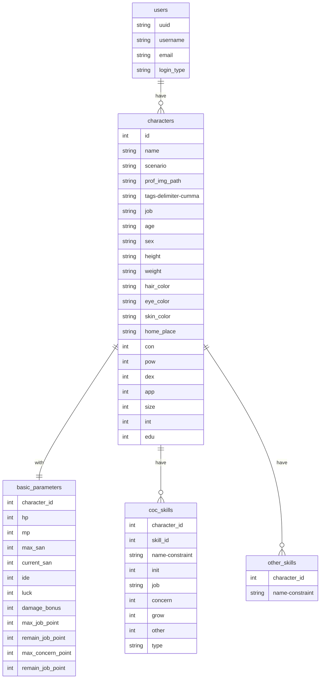

```mermaid
erDiagram

users ||--o{ characters : have
characters ||--|| basic_parameters : with
characters ||--o{ coc_skills : have
characters ||--o{ other_skills : have

users {
  string uuid
  string username
  string email
  string login_type
}

characters {
  int id
  string name
  string scenario
  string prof_img_path
  string tags-delimiter-cumma
  string job
  string age
  string sex
  string height
  string weight
  string hair_color
  string eye_color
  string skin_color
  string home_place
  int con
  int pow
  int dex
  int app
  int size
  int int
  int edu
}

basic_parameters {
    int character_id
    int hp
    int mp
    int max_san
    int current_san
    int ide
    int luck
    int damage_bonus
    int max_job_point
    int remain_job_point
    int max_concern_point
    int remain_job_point
}

coc_skills {
  int character_id
  int skill_id
  string name-constraint
  int init
  string job
  int concern
  int grow
  int other
  string type
}

other_skills {
    int character_id
    string name-constraint
}

```