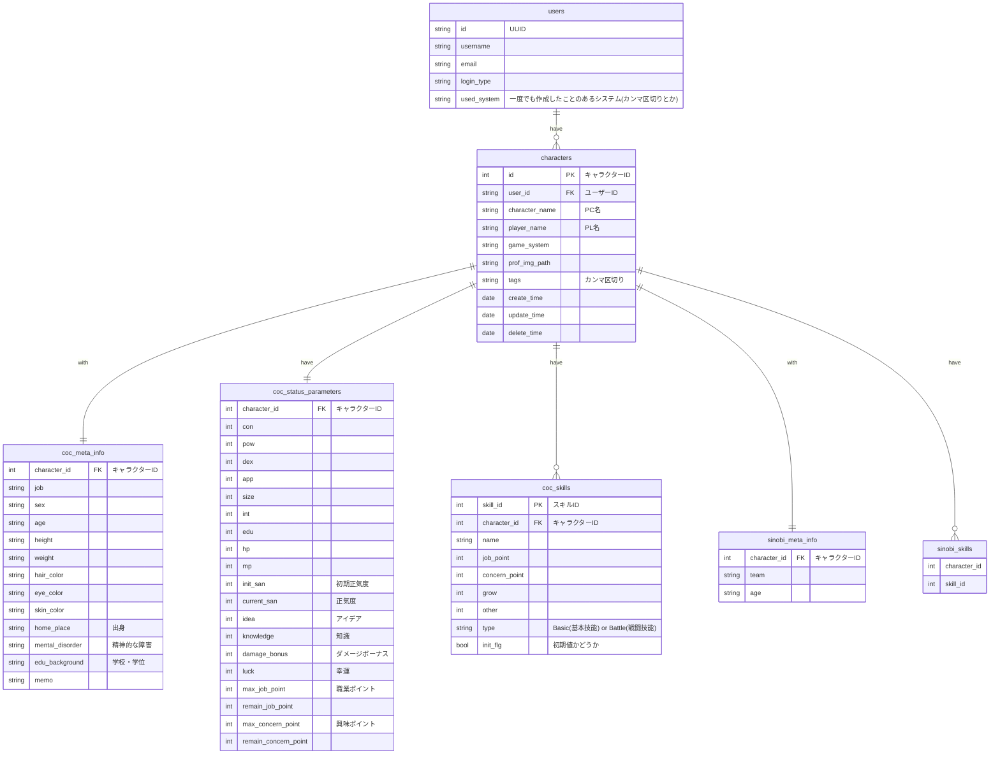

```mermaid
erDiagram

users ||--o{ characters : have
characters ||--|| coc_meta_info : with
characters ||--|| coc_status_parameters : have
characters ||--o{ coc_skills : have
characters ||--|| sinobi_meta_info : with
characters ||--o{ sinobi_skills : have

users {
  string id "UUID"
  string username
  string email
  string login_type
  string used_system "一度でも作成したことのあるシステム(カンマ区切りとか)"
}

characters {
  int id PK "キャラクターID"
  string user_id FK "ユーザーID"
  string character_name "PC名"
  string player_name "PL名"
  string game_system
  string prof_img_path
  string tags "カンマ区切り"
  date create_time
  date update_time
  date delete_time
}

coc_meta_info {
  int character_id FK "キャラクターID"
  string job
  string sex
  string age
  string height
  string weight
  string hair_color
  string eye_color
  string skin_color
  string home_place "出身"
  string mental_disorder "精神的な障害"
  string edu_background "学校・学位"
  string memo
}

coc_status_parameters {
  int character_id FK "キャラクターID"
  int con
  int pow
  int dex
  int app
  int size
  int int
  int edu
  int hp
  int mp
  int init_san "初期正気度"
  int current_san "正気度"
  int idea "アイデア"
  int knowledge "知識"
  int damage_bonus "ダメージボーナス"
  int luck "幸運"
  int max_job_point "職業ポイント"
  int remain_job_point
  int max_concern_point "興味ポイント"
  int remain_concern_point
}

coc_skills {
  int skill_id PK "スキルID"
  int character_id FK "キャラクターID"
  string name
  int job_point
  int concern_point
  int grow
  int other
  string type "Basic(基本技能) or Battle(戦闘技能)"
  bool init_flg "初期値かどうか"
}

sinobi_meta_info {
  int character_id FK "キャラクターID"
  string team
  string age
}

sinobi_skills {
  int character_id
  int skill_id
}
```
